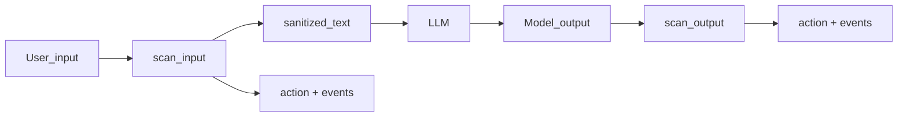

# Colandix

> Sanitize text before and after your LLM. Runs **locally**. No network calls in the library.

> Maps to French national guidance **ANSSI-PA-102** for generative AI security.

**Colandix** is a filtering layer that sits at the boundary between your application and the model. Safe content passes through. PII, secrets, and injection attempts do not reach the model.

[](docs/testing.md)
[](.python-version)
[](https://pypi.org/project/colandix/)
[](LICENSE)

---

## Install

```bash
pip install colandix
```

Development setup with `uv`:

```bash
uv sync --all-groups
```

### Optional pipelines (NER / SpaCy)

SpaCy pipelines are optional. Without them, regex, entropy, injection, and topic detectors still run; NER stays inactive.

| Extra | What it installs |
| :--- | :--- |
| `ner` | `spacy` only; then `python -m spacy download <pipeline>` (see [spacy.io/models](https://spacy.io/models)) |
| `ner-fr` | `fr_core_news_md` via PyPI (matches shipped profiles) |
| `ner-de`, `ner-en`, `ner-es`, `ner-it`, `ner-pt` | `spacy` only; install the pipeline with `python -m spacy download de_core_news_md` (etc.) |
| `ner-all` | `fr_core_news_md` wheel only; use `python -m spacy download` for other languages |

```bash
pip install "colandix[ner-fr]"
# or
pip install "colandix[ner]" && python -m spacy download fr_core_news_md
```

Bundled profiles default to `fr_core_news_md`. For another language, set `extra.model` and `entities` in your YAML (English uses `PERSON`, not `PER`).

---

## Quickstart

```python
from colandix import GuardPipeline

guard = GuardPipeline(profile="generique")
res_in = guard.scan_input("my prompt")

response = call_llm(res_in.sanitized_text)
guard.scan_output(response)
```

Tutorial: [notebooks/demo_colandix.ipynb](notebooks/demo_colandix.ipynb).

---

## What it does

The **colandix** library sits between your app and the model.



- **Scans** inputs and outputs with configurable detectors (PII, secrets, entropy, prompt injection, topics, optional NER).
- **Rewrites** sensitive spans in `sanitized_text` with typed tags (`[EMAIL_REDACTED]`, `[PHONE_REDACTED]`, `[PERSON_REDACTED]`, etc.).
- **Decides** an aggregate `action`: `pass`, `warn`, `human_review`, or `block`.
- **Logs** pseudonymized metadata; no raw prompts in logs.

---

## What a scan returns

| Field | Role |
| :--- | :--- |
| `result.action` | Aggregate decision (`Action` enum). |
| `result.sanitized_text` | Text to send to the LLM after masking. |
| `result.events` | Audit trail (evidence truncated for SIEM). |
| `result.blocked` | `True` when `action == block`. |
| `guard.find_all_candidates(text)` | Debug: list possible regex/NER hits. |

Injection and entropy detectors affect the decision only; they do not rewrite `sanitized_text`.

Redaction rules: [`colandix/redaction.py`](colandix/redaction.py), [Architecture](docs/architecture.md).

---

## Profiles

| Profile | Use case |
| :--- | :--- |
| `generique` | Everyday PII + injection. |
| `strict` | Broad PII and secrets + NER (requires SpaCy pipeline). |
| `sante` | Healthcare PII + medical topic guardrails. |
| `dev` | Credentials, secrets, sensitive dev topics. |
| `rh` | HR-sensitive wording and data. |
| `juridique` | Legal / confidentiality patterns. |

YAML sources: [`colandix/profiles/`](colandix/profiles/). Trigger reference: [docs/triggers-par-profil.md](docs/triggers-par-profil.md).

---

## ANSSI PA-102 alignment

Scope: content filtering and rewriting at the model boundary.

Official guide (PDF): [ANSSI generative AI security recommendations](https://messervices.cyber.gouv.fr/documents-guides/Recommandations_de_s%C3%A9curit%C3%A9_pour_un_syst%C3%A8me_d_IA_g%C3%A9n%C3%A9rative.pdf).

| Ref | Topic | Coverage | Status |
| :--- | :--- | :--- | :--- |
| **R25** | Input/output filtering | Regex, NER, entropy, injection, `sanitized_text`. | Yes |
| **R26** | Application interactions | `TopicDetector` (`allowed` / `blocked`). | Partial |
| **R27** | Human control | `Action.HUMAN_REVIEW`. | Partial |
| **R29** | Logging | Structured logger, no raw user text. | Partial |
| **R31** | Critical modules | Profile separation (`dev`, `juridique`, ...). | Partial |
| **R34** | Sovereign hosting | Runs offline in the orchestration path. | Yes |

Controls outside this package (TLS, IAM, org processes): [docs/compliance.md](docs/compliance.md).

---

## LLM integration

```python
from colandix import GuardPipeline
from colandix.exceptions import ColandixBlockedError

guard = GuardPipeline(profile="generique")

try:
    res_in = guard.scan_input(prompt, raise_on_block=True)
    response = call_llm(res_in.sanitized_text)
    guard.scan_output(response, raise_on_block=True)
except ColandixBlockedError:
    return "Content blocked."
```

Replace `call_llm` with your SDK. Use `raise_on_block=False` to branch on `result.action` yourself.

---

## Custom YAML

```python
guard = GuardPipeline(profile_path="/path/to/profile.yaml")
```

Start from [`colandix/profiles/`](colandix/profiles/). Detector keys: [docs/architecture.md](docs/architecture.md).

---

## Compliance report

```python
from colandix.compliance import print_report

print_report(guard.compliance_report())
```

---

## Documentation

- [Site](https://grosgradient.github.io/colandix) (GitHub Pages)
- [Architecture](docs/architecture.md)
- [Triggers by profile](docs/triggers-par-profil.md)
- [Testing](docs/testing.md)
- [Compliance (ANSSI)](docs/compliance.md)

---

## Docs (local preview)

```bash
uv run mkdocs serve     # http://127.0.0.1:8000, reloads on save
uv run mkdocs build     # static output in site/ (gitignored; CI rebuilds on deploy)
```

`mkdocstrings` requires the package to be importable at build time. `uv sync --all-groups` installs `colandix` in dev mode alongside the docs dependencies, matching what the GitHub Actions workflow does.

---

## Pre-deployment checklist

```bash
uv run pytest tests/ -q
uv run ruff check colandix tests
uv run mypy colandix
uv run mkdocs build
uv build
```

Manual checks:

- [ ] Version in `pyproject.toml` matches `colandix/__init__.py`.
- [ ] [docs/compliance.md](docs/compliance.md) updated if detectors or ANSSI scope changed.
- [ ] `pytest tests/test_detectors/test_ner.py -v` passes with `fr_core_news_md` installed.
- [ ] `notebooks/demo_colandix.ipynb` runs top-to-bottom without errors.
- [ ] `docs.yml` workflow completes on a push to `main`.

---

## Publishing (maintainers)

```bash
uv build
uv publish
```

Set PyPI tokens and bump `pyproject.toml` version before publishing.

---

## Contributing

1. Fork the repo.
2. `git checkout -b feature/your-change`
3. `uv run pytest tests/` (~362 cases)
4. Open a Pull Request.

---

## License

MIT — see [LICENSE](LICENSE).
© 2026 [Gros Gradient](https://www.grosgradient.com/)

---

## Pour les équipes ANSSI et security reviewers

La bibliothèque **colandix** est développée par [Gros Gradient](https://www.grosgradient.com/). La cartographie **R25–R35**, `sanitized_text` / `action`, et le périmètre bibliothèque sont dans [docs/compliance.md](docs/compliance.md) (anglais). Le guide officiel ANSSI (IA générative) reste la référence réglementaire en français : [PDF recommandations ANSSI](https://messervices.cyber.gouv.fr/documents-guides/Recommandations_de_s%C3%A9curit%C3%A9_pour_un_syst%C3%A8me_d_IA_g%C3%A9n%C3%A9rative.pdf).
